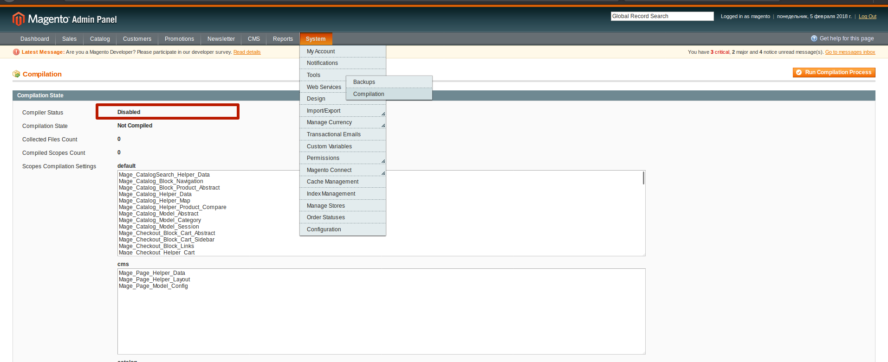
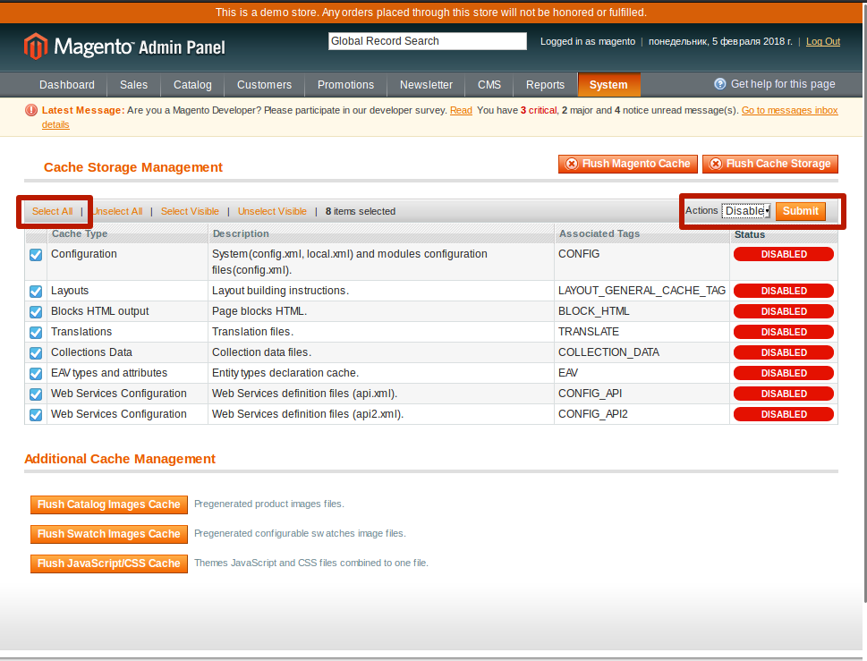
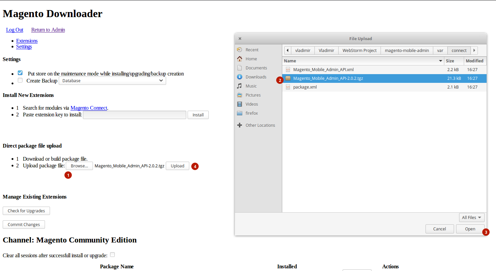

 Для установки модуля необходимо:
 
 1. Disable Compilation (System->Tools->Compilation->Disable)
 
 2. Disable Cache (System->Cache Management->Select All->Disable)
 
 3. Open page for install module (System->Magento Connect->Magento Connect Manager)
     -in block "Direct package file upload" select file and click Upload.

 4. If there are no installation errors, you can use the module for the application.

 Installation is done.

#### Use this link to download applications:
 * [Google Play](https://play.google.com/store/apps/details?id=com.pinta.magento.magentomobileadmin)
 * [AppStore](https://itunes.apple.com/ua/app/magento-mobile-admin/id1229150311?l=ru&mt=8)

 For log in app, please, use **admin email** and password.